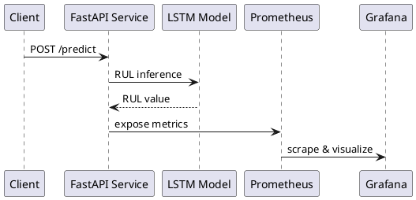

## Predictive Maintenance Platform

This project is motivated by the emergence of **Industry 4.0 (I4.0)**, where smart systems, machine learning (ML), and predictive maintenance techniques are increasingly adopted to monitor and manage the health of industrial equipment, [read more](https://www.mdpi.com/2071-1050/12/19/8211).

Thanks to modern **information technologies and communication networks**, it is now possible to collect large volumes of operational and process data from industrial assets. These data enable **automated fault detection, diagnostics, and Remaining Useful Life (RUL) estimation**, with the goal of:

* Minimizing unplanned downtime
* Increasing equipment utilization
* Extending component lifetimes

---

## Scope of This Work

The objective of this project is to solve a **regression problem**:
predicting the **Remaining Useful Life (RUL)** of turbofan engines using a **Long Short-Term Memory (LSTM)** neural network.

The model is trained and evaluated using the **NASA C-MAPSS Turbofan Engine Degradation Dataset**, a widely used benchmark in predictive maintenance research.

---

## Key Features

* **Deep learning–based RUL prediction** using LSTM networks
* **FastAPI backend** for real-time inference
* **Dockerized deployment** for reproducibility
* **Prometheus metrics** for monitoring predictions and errors
* **Grafana dashboards** for visualization and alerting
* Modular codebase following **MLOps-friendly structure**

---

## Runtime View



---

## Usage

### 1. Build and run services

```bash
docker-compose up -d
```
or for running just the api locally (development)
```powershell
uvicorn src.api.main:app --reload
```

### 2. Access services

* **API Docs**: [http://localhost:8000/docs](http://localhost:8000/docs)
* **Prometheus**: [http://localhost:9090](http://localhost:9090)
* **Grafana**: [http://localhost:3000](http://localhost:3000)

(Default Grafana credentials: `admin / admin`)

> *A Grafana dashboard is used to visualize prediction volume, error rates, and the latest RUL estimates.*

---

## Dataset

This project is based on the dataset provided by Saxena et. al (2008).The NASA Turbofan Engine Degradation Simulation:

> Saxena, A., Goebel, K., Simon, D., & Eklund, N. (2008).
> *Damage Propagation Modeling for Aircraft Engine Run-to-Failure Simulation.*
>>>

---

## Notes for Reviewers

* This project focuses on **backend, ML inference, and monitoring**, not frontend development
* The monitoring stack (Prometheus + Grafana) is included for **demonstration and observability**, not production-scale deployment
* The architecture is intentionally designed to be **simple, interpretable, and extensible**


